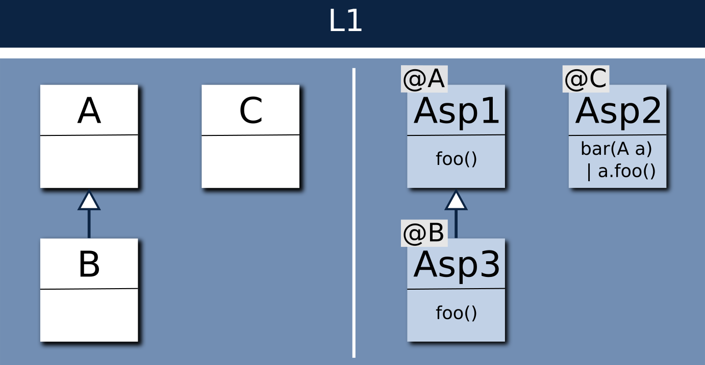
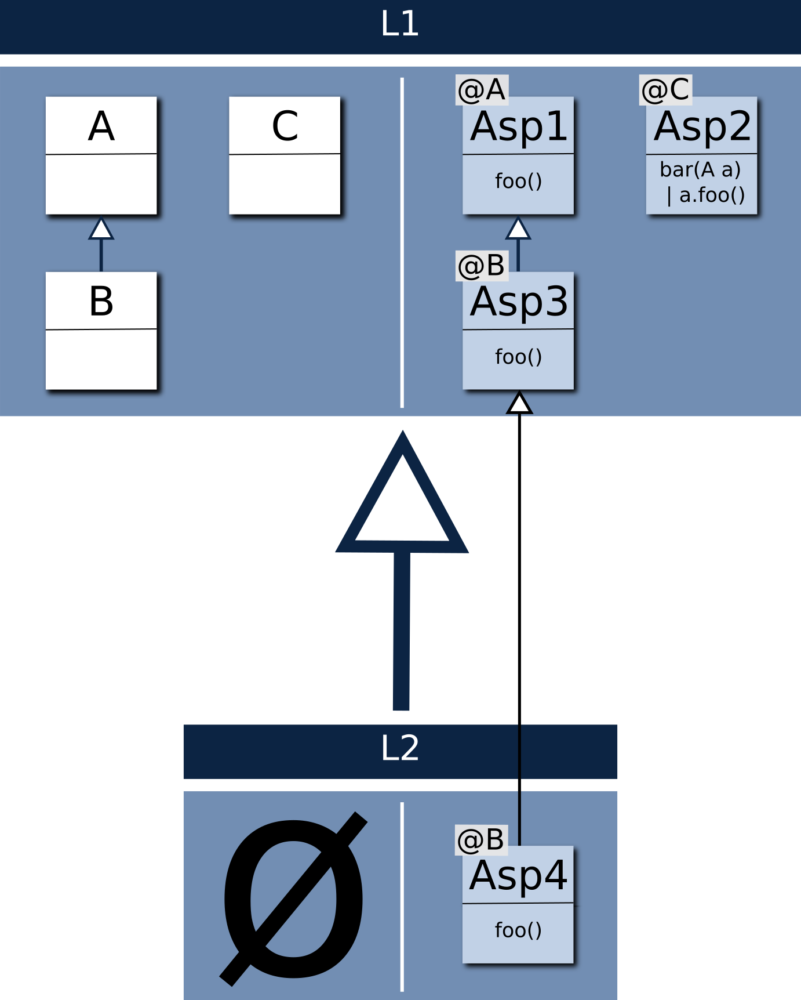

Simple Language
---------------

1. Definition

Lets consider the language L1 with metaclasses A, C and B inheriting A.
The semantic of L1 is composed of the following aspects:

~~~java
@Aspect(classname = A)
class Asp1 {
	def void foo {
		println("Asp1.foo")
	}
}

@Aspect(classname = C)
class Asp2 {
	def void bar(A a) {
		a.foo()
	}
}

@Aspect(classname = B)
class Asp3 inherits Asp1 {
	def void foo {
		println("Asp3.foo")
	}
}

~~~

We have this transfo defined on L1:

~~~java
PrinterTransfo(Resource model_l1) {
	val A a = findA(model_l1)
   val B b = findB(model_l1)
   val C c = findC(model_l1)

	a.foo()
	b.foo()
	c.bar(a)
	c.bar(b)
}
~~~

Calling PrinterTransfo will print:

~~~java
Asp1.foo
Asp3.foo
Asp1.foo
Asp3.foo
~~~

2. Implementation

The basic purpose of K3 is to transform an Aspect to a Java class exposing static methods in order the reuse it as Xtend's extension method.
So from the body of 'PrinterTransfo' :

~~~java
	a.foo()
	b.foo()
	c.bar(a)
	c.bar(b)
~~~

Xtend generates the Java lines :

~~~java
Asp1.foo(a)
Asp3.foo(b)
Asp2.bar(c,a)
Asp2.bar(c,b)
~~~

And if we look inside Asp2.bar(A) :

~~~java
		a.foo()
~~~

Xtend will generates :

~~~java
	Asp1.foo(a)
~~~

So to resum the last line of PrinterTransfo, we have:
Asp2.bar(c,b) calling Asp1.foo(b)

As we want to call Asp3.foo(b) at the end, Asp1.foo(A) has to dispatch to the right aspect's method depending if the argument is typed A or a subtype of A.
To do so the K3 generated body of Asp1.foo(A _self) looks like:

~~~java
	if(_self instanceof B) Asp3.foo((B)_self)
	else if(_self instanceof A) Asp1.privk3_foo(_self)
	else throw new IllegalArgumentException 
~~~

K3 generates a cascade of instanceof on the list of all subtypes of A, and for each case calls the most specific aspect (among the overriding aspects).
For example Asp3.foo(A) is selected because Asp3 overrides Asp1, is defined over B and defines foo().

Composed Language
-----------------

1. Definition

Now lets consider a language L2 inheriting L1 without new syntax but adding a new aspect Asp4 on B and redefining foo():

~~~java
@Aspect(classname = B)
class Asp4 inherits Asp3 {
	def void foo {
		println("Asp4.foo")
	}
}
~~~

We have this transfo defined on L2:

~~~java
PrinterTransfo2(Resouce model_l2) {
	val A a = findA(model_l2)
   val B b = findB(model_l2)
   val C c = findC(model_l2)

	a.foo()
	b.foo()
	c.bar(a)
	c.bar(b)
}
~~~

Calling PrinterTransfo2 will print:

~~~java
Asp1.foo
Asp4.foo
Asp1.foo
Asp4.foo
~~~

2. Implementation

From the body of 'PrinterTransfo2' :

~~~java
	a.foo()
	b.foo()
	c.bar(a)
	c.bar(b)
~~~

Xtend generates the Java lines :

~~~java
Asp1.foo(a)
Asp4.foo(b)
Asp2.bar(c,a)
Asp2.bar(c,b)
~~~

Since Asp2 is the same as in L1, at the last line of PrinterTransfo2 we have:
Asp2.bar(b) calling Asp1.foo(b)

But now we want that Asp1.foo(A) dispatchs to Asp4.foo(B). So Melange will recompute the previously K3 generated dispatch to take in account the introduced aspect 'Asp4'.
The result of this generation for Asp1.foo(A _self) looks like:

~~~java
	if(_self instanceof B) Asp4.foo((B)_self)
	else if(_self instanceof A) Asp1.privk3_foo(_self)
	else throw new IllegalArgumentException 
~~~

Like K3, Melange generates a cascade of instanceof on the list of all subtypes of A, and for each case call the most specific aspects.

First we select all aspects overriding Asp1 and redefining foo().
Then we select the aspect woven on the closest super type of B. If several aspects are elligibles, we select the aspect defined in the closest language.

For example in the case of (_self instanceof B) we have Asp1, Asp3 and Asp4 appliables on B and defining/overriding Asp1.foo(), Asp3 and Asp4 are woven on B so their are more specific than Asp1, and Asp4 is defined in L2 which has the priority on L1. So we call Asp4.foo(_self) when calling Asp1.foo(_self) and self instance of B.
